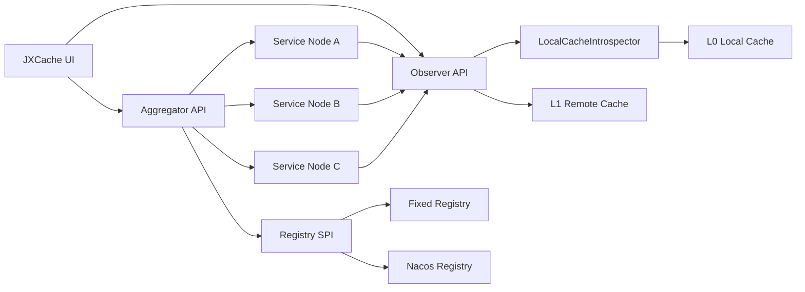

# JXCache

[License](LICENSE)
[Java](https://www.oracle.com/java/)
[Spring Boot](https://spring.io/projects/spring-boot)
[JetCache](https://github.com/alibaba/jetcache)
[Vue](jxcache-ui)

JXCache 是一个面向 JetCache 体系的缓存可观测与治理扩展，聚焦**本地缓存可视化、跨节点聚合查询、缓存一致性排查和缓存失效操作**。它不是另一个缓存框架，而是给已经落地 JetCache 的 Spring Boot 微服务补上一层可观察、可诊断、可扩展的工程化能力。

## 项目亮点

- **面向真实微服务场景**：支持单节点 Observer 与跨节点 Aggregator 两种角色，可以覆盖本地排查、服务实例横向对比和多 Pod 缓存一致性检查。
- **只读扫描优先，减少观测污染**：列表扫描默认聚焦 L0 本地缓存；单 key 查询支持 L0/L1/AUTO，并避免 MultiLevelCache 读取触发远端回填造成误判。
- **插件化缓存内省模型**：通过 `LocalCacheIntrospector` 扩展不同本地缓存实现，当前已支持 JetCache Caffeine 与 LinkedHashMap 本地缓存。
- **注册中心 SPI 化**：内置 Fixed 与 Nacos 两种注册中心实现，通过优先级选择和固定配置兜底，方便从本地调试过渡到服务发现环境。
- **聚合查询工程化**：使用并发查询、单节点超时、总超时、失败节点记录和部分结果返回机制，避免单个慢节点拖垮整体排查链路。
- **Dubbo 消费端先缓存调用插件**：通过 Dubbo `ProxyFactory` SPI 在 consumer 侧先执行 JetCache `@Cached` 逻辑，缓存未命中时再转调 no-cache RPC 方法，避免 provider 端重复走一轮缓存代理。
- **前后端一体化样例**：后端提供 Spring Boot Starter，前端提供 Vue 3 + TypeScript 管理界面，样例工程覆盖 LOCAL 与 BOTH 缓存、多节点和 Nacos/Redis 场景。

## 能力边界


| 能力          | 当前状态    | 说明                                           |
| ----------- | ------- | -------------------------------------------- |
| 本地缓存扫描      | 已支持     | 支持分页、前缀过滤、分片查询，当前聚焦可枚举的 L0 本地缓存              |
| 单 key 完整值查询 | 已支持     | 支持 L0、L1、AUTO 查询模式                           |
| 跨节点聚合查询     | 已支持     | 支持按服务名聚合、按目标节点过滤、失败节点标记                      |
| 缓存一致性检查     | 已支持     | 对同一 key 在多节点上的值进行对比                          |
| 缓存失效        | 已支持     | 支持单节点和跨节点指定 key 失效                           |
| 注册中心        | 已支持     | Fixed 与 Nacos，Fixed 可作为兜底                    |
| Web UI      | 已支持     | Vue 3、Element Plus、TypeScript、i18n           |
| 鉴权与限流       | 预留扩展    | 已提供 `AccessGuard`、`RateLimiter` SPI，默认实现暂时放行 |
| 指标、审计、告警    | Roadmap | 适合后续接入 Micrometer、Prometheus、审计日志            |


## 架构设计




JXCache 按职责拆分为基础模型、缓存观察、注册中心、聚合查询、Spring Boot Starter、样例和前端 UI。模块边界保持清晰，方便按需引入，也方便后续把注册中心、缓存内省器、安全策略独立扩展。

## 模块结构

```text
jxcache
├── jxcache-common                    # DTO、SPI、默认 ValuePreviewer/AccessGuard/RateLimiter
├── jxcache-observer                  # 单节点本地缓存观察、扫描、详情、失效
├── jxcache-registry-spi              # 注册中心抽象与选择工厂
├── jxcache-registry-fixed            # 静态配置注册中心
├── jxcache-registry-nacos            # Nacos 服务发现注册中心
├── jxcache-dubbo                     # Dubbo consumer 侧先缓存调用插件核心
├── jxcache-aggregator-core           # 跨节点聚合查询、一致性检查、批量失效
├── jxcache-starter-observer          # Observer Spring Boot Starter
├── jxcache-starter-aggregator-core   # Aggregator Spring Boot Starter
├── jxcache-starter-aggregator-nacos  # Aggregator + Nacos 组合 Starter
├── jxcache-starter-dubbo             # Dubbo consumer 侧缓存插件 Starter
├── jxcache-tests                     # 单元测试、集成测试、冒烟测试
├── samples                           # water / river / ocean 示例工程
├── jxcache-ui                        # Vue 3 + TypeScript 管理界面
└── docs                              # API 与模块结构文档
```

## 快速开始

### 环境要求

- JDK 1.8+
- Maven 3.6+
- Spring Boot 2.3.x
- JetCache 2.7.x
- Node.js 16+（仅运行前端 UI 时需要）

如果依赖尚未发布到远程 Maven 仓库，请先在项目根目录执行本地安装：

```bash
mvn clean install
```

### 接入 Observer

在需要被观测的业务服务中加入 Observer Starter：

```xml
<dependency>
    <groupId>dev.yibin</groupId>
    <artifactId>jxcache-starter-observer</artifactId>
    <version>1.0.0</version>
</dependency>
```

配置 `application.yml`：

```yaml
jxc:
  observer:
    enabled: true
    maxPageSize: 200
    maxValuePreview: 200
    totalShards: 8
```

### 接入 Aggregator

简单环境可以使用 Fixed 注册中心：

```xml
<dependency>
    <groupId>dev.yibin</groupId>
    <artifactId>jxcache-starter-aggregator-core</artifactId>
    <version>1.0.0</version>
</dependency>
<dependency>
    <groupId>dev.yibin</groupId>
    <artifactId>jxcache-registry-fixed</artifactId>
    <version>1.0.0</version>
</dependency>
```

```yaml
jxc:
  aggregator:
    enabled: true
    perNodeTimeoutMs: 2000
    totalTimeoutMs: 4000
    maxConcurrency: 16
    observerScanPath: /api/jxc/observer/query
    observerEntryPath: /api/jxc/observer/entry
    observerInvalidatePath: /api/jxc/observer/invalidate
  registry:
    fixed:
      enabled: true
      priority: 1000
      services:
        - name: demo-app
          nodes:
            - nodeId: n1
              host: 127.0.0.1
              port: 18081
              healthy: true
            - nodeId: n2
              host: 127.0.0.1
              port: 18082
              healthy: true
```

使用 Nacos 时引入组合 Starter：

```xml
<dependency>
    <groupId>dev.yibin</groupId>
    <artifactId>jxcache-starter-aggregator-nacos</artifactId>
    <version>1.0.0</version>
</dependency>
```

```yaml
jxc:
  aggregator:
    enabled: true
    perNodeTimeoutMs: 2000
    totalTimeoutMs: 4000
    maxConcurrency: 16
    http:
      connectTimeoutMs: 5000
      readTimeoutMs: 10000
      connectionRequestTimeoutMs: 2000
      maxTotal: 200
      maxPerRoute: 50
      evictIdleConnectionsSeconds: 30
  registry:
    nacos:
      enabled: true
      priority: 100
      cache:
        enabled: true
        expireSeconds: 10
        maxSize: 1000
        enableListener: false
    fixed:
      enabled: true
      priority: 1000
      services:
        - name: demo-app
          nodes:
            - nodeId: fallback-1
              host: 127.0.0.1
              port: 18081
              healthy: true
```

### 接入 Dubbo Consumer 侧缓存插件

在 Dubbo consumer 服务中加入 Starter：

```xml
<dependency>
    <groupId>dev.yibin</groupId>
    <artifactId>jxcache-starter-dubbo</artifactId>
    <version>1.0.0</version>
</dependency>
```

插件默认开启：

```yaml
jxc:
  dubbo:
    enabled: true
```

推荐按 consumer-first 的方式声明接口：缓存方法放在接口 `default` 方法里，真正的 RPC 调用放到对应的 `NoCache` 方法。

```java
public interface UserService {

    @Cached(name = "userCache", key = "#userId", expire = 60, cacheType = CacheType.LOCAL)
    default UserDTO getUser(String userId) {
        return getUserNoCache(userId);
    }

    UserDTO getUserNoCache(String userId);
}
```

这样 consumer 调用 `getUser()` 时，会先在本地执行 JetCache 拦截；只有缓存未命中时，才会通过 `getUserNoCache()` 发起一次 Dubbo RPC。

### 启动 UI

```bash
cd jxcache-ui
npm install
npm run dev
```

默认访问 `http://localhost:5173`。Observer 与 Aggregator 后端地址可分别通过 `VITE_OBSERVER_URL`、`VITE_AGGREGATOR_URL` 指定。

## API 速览

### Observer API

- `GET /api/jxc/observer/areas`：获取当前节点缓存区域。
- `POST /api/jxc/observer/query`：扫描本地缓存快照。
- `GET /api/jxc/observer/entry?area=default&name=cacheName&key=cacheKey&level=AUTO`：查询单个 key 完整值。
- `DELETE /api/jxc/observer/invalidate?area=default&name=cacheName&key=cacheKey`：失效单个本地缓存 key。
- `POST /api/jxc/observer/areas/recompute`：刷新 JetCache area 配置。

### Aggregator API

- `GET /api/jxc/aggregate/nodes?serviceName=demo-app`：获取目标服务节点列表。
- `POST /api/jxc/aggregate/query?serviceName=demo-app`：跨节点聚合扫描缓存。
- `GET /api/jxc/aggregate/entry?serviceName=demo-app&area=default&name=cacheName&key=cacheKey`：跨节点查询单个 key。
- `GET /api/jxc/aggregate/entry/consistency?serviceName=demo-app&area=default&name=cacheName&key=cacheKey`：检查多节点缓存值一致性。
- `POST /api/jxc/aggregate/invalidate?serviceName=demo-app`：跨节点失效指定 key。

完整请求和响应结构见 [API 参考文档](docs/api-reference.md)。

## 示例工程

`samples` 目录提供三组递进式样例：

- `water`：仅启用 Observer，模拟多个 LOCAL 缓存节点。
- `river`：同时启用 Observer 与 Aggregator，演示跨节点聚合查询。
- `ocean`：集成 Nacos 与 Redis，演示 BOTH 缓存、多节点部署和缓存失效。

更多说明见 [示例项目文档](samples/README.md)。

## 性能与稳定性设计

- 聚合查询通过固定线程池控制并发，避免排查请求挤占业务线程。
- 每个节点有独立超时，整体查询有总超时，慢节点会被标记为失败节点并返回部分结果。
- HTTP 客户端使用连接池，适合多节点频繁查询场景。
- Nacos 实例列表支持 Caffeine 本地缓存，默认 TTL 刷新，减少注册中心压力。
- 本地缓存列表查询支持分页、前缀过滤和分片，降低大缓存扫描的响应体大小。

推荐根据服务规模调整以下配置：

```yaml
jxc:
  aggregator:
    perNodeTimeoutMs: 2000
    totalTimeoutMs: 4000
    maxConcurrency: 16
    http:
      maxTotal: 200
      maxPerRoute: 50
  registry:
    nacos:
      cache:
        expireSeconds: 10
```

## 开发与测试

```bash
# 后端单元测试和集成测试
mvn test

# 后端完整验证
mvn verify

# 前端类型检查和构建
cd jxcache-ui
npm install
npm run build
```

项目使用 JUnit 5、Mockito、AssertJ、Spring Boot Test 和 JaCoCo。测试覆盖 DTO、SPI、自动配置、Observer、Aggregator、注册中心和跨模块冒烟场景。

## Roadmap

- **安全治理**：完善 `AccessGuard` 与 `RateLimiter` 默认实现，支持 token、IP 白名单、操作审计和危险操作二次确认。
- **更多注册中心**：扩展 Eureka、Consul、Kubernetes Endpoints 等服务发现实现。
- **更多缓存类型**：扩展 Guava、自定义本地缓存和更多 JetCache 内部结构适配。
- **观测指标**：接入 Micrometer/Prometheus，提供查询耗时、失败节点、缓存命中和失效操作指标。
- **OpenAPI 与 SDK**：补齐 OpenAPI 文档，生成 Java/TypeScript 客户端，方便平台化集成。
- **UI 增强**：增加拓扑视图、节点健康态、缓存 diff、审计记录和只读/运维角色视图。
- **发布工程**：补充 GitHub Actions、Maven Central 发布流程、版本变更日志和贡献模板。

## 贡献

欢迎提交 Issue、Pull Request 或场景反馈。建议优先从以下方向参与：

- 补充不同 JetCache 配置下的样例和测试。
- 新增注册中心或缓存内省器实现。
- 完善 UI 交互、国际化和可视化能力。
- 改进文档、示例脚本和部署流程。

提交代码前请尽量运行：

```bash
mvn test
cd jxcache-ui && npm run build
```

## License

JXCache 基于 [Apache License 2.0](LICENSE) 开源。